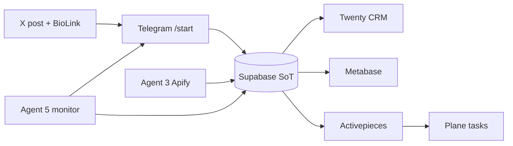

# Case Study Mapping — Growth OS v2

Maps the **MCM Vendor Hermes XAUUSD** implementation to the [addyosmani/agent-skills](https://github.com/addyosmani/agent-skills) case study pattern and resale bundle structure.

---

## Case study narrative

> A solo founder runs XAUUSD growth via X accounts and vendors. Traffic flows through BioLink → Telegram. One Hermes instance orchestrates capture, nurture, intelligence, CRM, vendor tasks, and daily operating rhythm — with Supabase as the single source of truth.

---

## Module mapping

| Case study module | This repo | Phase | Primary artifact |
| ----------------- | --------- | ----- | ---------------- |
| Source of truth | Supabase/Postgres | 0 | `db/schema.sql`, `sync_to_supabase.py` |
| Attribution capture | Agent 1 | 1 | `agent1-capture.yaml`, deep link parser |
| Onboarding nurture | Agent 2 | MVP doc | `agent2-onboard.yaml`, sop-ops D1–D7 |
| Daily intelligence loop | Agent 3 | 4 | `agent3-daily-loop.yaml`, Apify scripts |
| CRM pipeline | Agent 4 | 2 | `agent4-twenty-crm-sync.yaml`, Twenty sync |
| Operating rhythm | Agent 5 | 8–10 | `agent5-monitor.yaml`, health + reports |
| Founder dashboard | Metabase | 3 | `metabase-dashboard-spec.md`, `views.sql` |
| Vendor workboard | Plane | 6 | `plane-board-spec.md`, `create_plane_task.py` |
| Automation bridge | Activepieces | 7 | `activepieces-flows-spec.md` |
| Content performance | Tracker | 5 | `content_performance` table + CLI |
| Launch validation | E2E test | 9 | `e2e_launch_test.py` |
| SOP package | Bundle | 10 | README, manifest, runbook, this file |

---

## Agent-skills lifecycle per phase

| Phase | DEFINE | PLAN | BUILD | VERIFY | REVIEW | SHIP |
| ----- | ------ | ---- | ----- | ------ | ------ | ---- |
| 0 | SoT requirements | ADR 001 | schema.sql | health | ADR review | sync script |
| 1 | Attribution rules | deep link spec | capture yaml | test-join | parse edge cases | telegram report |
| 2 | CRM stages | twenty-pipeline.json | sync_to_twenty | test-sync | Twenty vs Espo ADR | agent4 yaml |
| 3 | 8 dashboard sections | metabase spec | views.sql | SQL smoke | founder KPIs | spec doc |
| 4 | Country intel | apify config | crawl + normalize | test-canada | classify quality | agent3 yaml |
| 5 | Winning content | join_rate rules | content CLI | content-test | attribution | views |
| 6 | Vendor SOP | plane-board.json | create_plane_task | test | team Tuấn workflow | spec |
| 7 | 6 automation flows | flows.json | webhook test | log-failure | no n8n ADR | spec |
| 8 | 8PM report format | report-founder.txt | health_check | founder-daily dry | failed services | agent5 yaml |
| 9 | E2E journey | launch checklist | e2e_launch_test | 12 steps pass | rollback reviewed | checklist |
| 10 | Resale bundle | manifest | README + CLAUDE | bundle 100% | case study map | package |

---

## Data flow (lead journey)



**E2E test simulates:** join → content attribution → CRM dry-run → Apify sample → vendor task → automation log → views → health → founder report.

---

## What to customize for a new vertical

| Customize | Examples (XAUUSD → other) |
| --------- | ------------------------- |
| Deep link campaigns | `goldhook_20260624` → `fitness_challenge_2026` |
| CRM stage labels | Paid/VIP → Trial/Subscriber |
| Apify hashtags | `#xauusd` → `#fitness` `#saas` |
| Nurture D1–D7 copy | Gold setups → product demo sequence |
| Metabase cards | KPI names, currency |
| Plane task template | Post format, CTA |
| Country targets | UAE/Canada → US/UK |

---

## What NOT to change (framework core)

- 1 Hermes + 5 skill YAML files (no Agent 6)
- Supabase as write path SoT
- `activity_logs` on automations
- Agent 5 incremental bundle after each phase SHIP
- Twenty over EspoCRM for new deployments (ADR 002)
- Activepieces before n8n for MVP (ADR 004)

---

## Bundle completeness (Phase 10)

All items in [`bundle-manifest.md`](bundle-manifest.md) should be ✅ before resale/handoff.

Verify:

```bash
python scripts/health_check.py bundle
python scripts/e2e_launch_test.py
```

---

*Phase 10 SHIP — SOP bundle hoàn chỉnh*
